# chapt0x01
## 软件环境
Windows

VirtualBox

Ubuntu 18.04 Server 64bit
## 如何配置无人值守安装iso并在Virtualbox中完成自动化安装。
### 1.手动安装一个Ubuntu虚拟机

### 2.配置双网卡
#### ifconfig 查看配置网卡：只显示NAT网络网卡

#### 按照老师视频修改01-netcfg.yaml文件（Virtualbox安装完Ubuntu之后新添加的网卡如何实现系统开机自动启用和自动获取IP？）

root权限：

        vi /etc/netplan/01-netcfg.yaml
        netplan apply

#### ifconfig显示双网卡，enp0s8处于DOWN状态

#### ifconfig enp0s8 up，开启UP状态

ip a显示如下

### 3.putty连接虚拟机
#### 打开putty，输入host-only网卡ip，连接虚拟机

### 4.使用psftp将用于ubuntu18.04.4镜像文件复制进虚拟机
#### psftp连接虚拟机

open+'hostname'

输入用户名密码就可以连接

#### 将镜像文件传送到虚拟机 ：

cd /home/lyl

put [本地文件地址+文件名] [虚拟机文件地址+文件名]

### 5.挂载iso文件，克隆光盘内容
#### 在当前用户目录下（/home/lyl）创建一个用于挂载iso镜像文件的目录
mkdir loopdir
#### 挂载iso镜像文件到该目录
root权限：mount  /home/lyl/ 1.iso loopdir

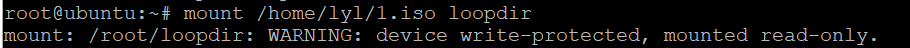

#### 创建一个工作目录用于克隆光盘内容
mkdir cd
#### 同步光盘内容到目标工作目录
rsync -av loopdir/ cd

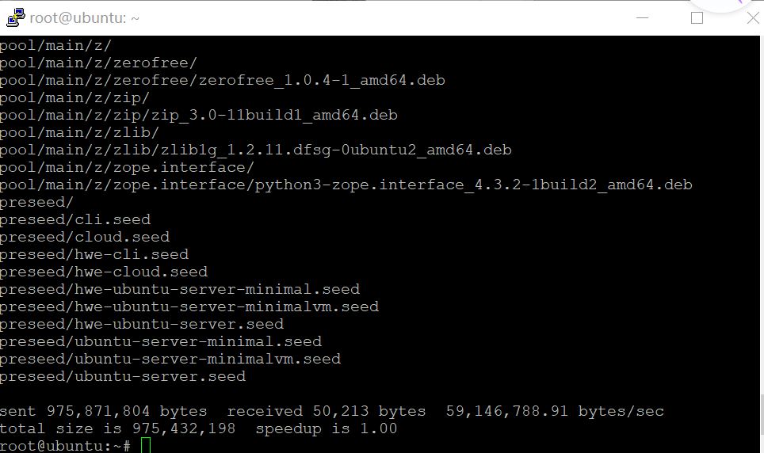

#### 卸载iso镜像
umount loopdir
#### 进入目标工作目录
cd cd/
### 6.剩下步骤
#### 编辑Ubuntu安装引导界面增加一个新菜单项入口
vim isolinux/txt.cfg

添加以下内容到该文件

label autoinstall
  
  menu label ^Auto Install Ubuntu Server
  
  kernel /install/vmlinuz
  
  append  file=/cdrom/preseed/ubuntu-server-autoinstall.seed debian-installer/locale=en_US console-setup/layoutcode=us keyboard-configuration/layoutcode=us console-setup/ask_detect=false localechooser/translation/warn-light=true localechooser/translation/warn-severe=true
 initrd=/install/initrd.gz root=/dev/ram rw quiet---

 强制保存退出：
 Esc+wq！
 #### 用pstfp将老师提供ubuntu-server-autoinstall.seed传输到工作目录/home/cuc/cd/preseed/
 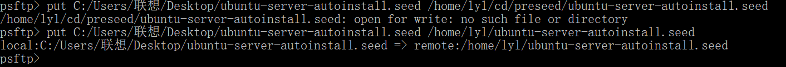

 #### 重新生成md5sum.txt
cd /home/lyl/cd && find . -type f -print0 | xargs -0 md5sum > md5sum.txt
#### 封闭改动后的目录到.iso
IMAGE=custom.iso

BUILD=/home/lyl/cd/
 
 apt-get install genisoimage

mkisofs -r -V "Custom Ubuntu Install CD" \
            -cache-inodes \
            -J -l -b isolinux/isolinux.bin \
            -c isolinux/boot.cat -no-emul-boot \
            -boot-load-size 4 -boot-info-table \
            -o $IMAGE $BUILD
#### 将custom.iso文件移到根目录，用psftp复制到本机
mv custom.iso ../

打开psftp

get custom.iso [本机地址]
#### 新建虚拟机，设置光驱为custom.iso，启动虚拟机，实现自动安装

[无人值守自动安装录屏](https://www.bilibili.com/video/BV1FE411c7ob)

## 如何使用sftp在虚拟机和宿主机之间传输文件？
### 1.查看ssh服务是否安装，若否，安装ssh服务
查看ssh服务：ps -e |grep ssh

安装ssh服务：apt-get install openssh-server

### 2.Xshell6采用sftp与linux虚拟机连接
sftp [remotehost IP]

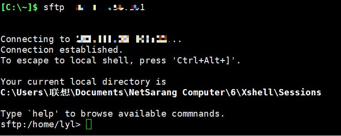

### 3.在图形用户面板上 窗口->传输新建文件，打开xftp的字符界面,直接关闭即可打开一个sftp窗口

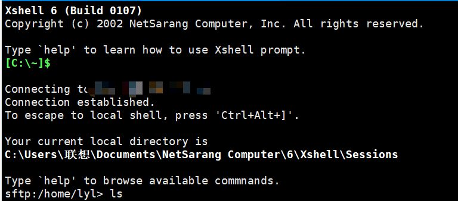

#### (1)从服务器下载文件到本机
##### 切换到本地的d盘下

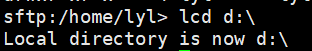

##### 下载远程服务器上的.profile文件

get .profile

在d盘中

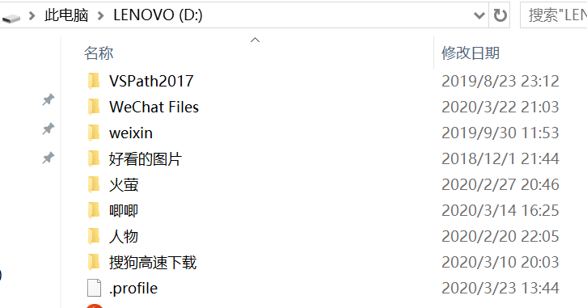

#### (2)上传本地文件到远程服务器
##### 切换本地文件的路径

##### 传送本地文件

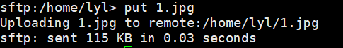

## 出现的问题
### 1.host-only网卡的ip地址不显示
第一次尝试的时候出现这个问题，向老师提问后，发现是关闭了DHCP服务器，开启后解决
第二次尝试出现此问题，看完老师在b站上的视频，发现是01-netcfg.yaml没有改，改后解决。
### 2.pstfp传送文件的时候总是出现找不到cd目录
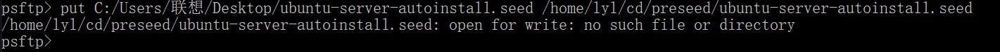

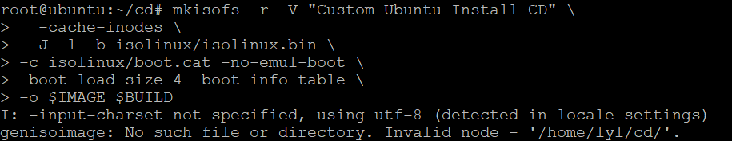

解决方法：修改路径格式。暂时还没有找到规律
### 3.或者是访问cd目录被拒绝

解决方法：先传入根目录，再在虚拟机上用mv移到指定文件。没有找到原因。
### 4.在启动新的虚拟机的时候，出现下面的情况
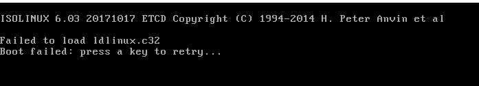

不知道之前那些步骤出了差错，只好从头再来一遍，又出现下面的情况

咨询其他同学，说是txt.cfg文件写错，但是我的是复制的，不应该会错。

其他同学又说虚拟机必须加载iso镜像文件，尝试失败了两次（每次进入登陆页面，光驱就会消失）。

又只好再来一遍，最后一遍成功。应该是中间操作失误，不是镜像文件的问题。
### 5.虚拟机打开失败

网上查询，试了好几种方法，没有成功，找不到问题源头，只好重装。
### 6.Xshell6连接不上虚拟机

sshd服务没有安装打开

[解决参考](https://www.e-learn.cn/content/linux/456204)

## 附加问题：对比官方preseed.cfg文件与老师seed文件的不同

SEED文件用于预置，用于自动安装过程的方法。

左边为老师文件，右边为官方文件

1.官方文件里很多地方没有写入具体值

2.改动

3.官方文件里注释掉，老师的文件去掉#

4.官方文件有，老师的文件里没有

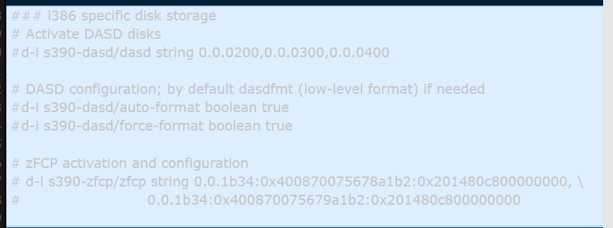

### 老师的文件更具体，有特定的用途和功能。添加配置内容，相当于手动时的选择配置，作用于自动安装。改动的地方：取消倒计时等。

[文本文件对比网站](http://www.jq22.com/textDifference)

## 参考文献 
[老师ppt](https://c4pr1c3.github.io/LinuxSysAdmin/chap0x01.exp.md.html#/title-slide)

[自动安装具体步骤-参考](https://blog.csdn.net/qq_31989521/article/details/58600426?depth_1-utm_source=distribute.pc_relevant.none-task&utm_source=distribute.pc_relevant.none-task)

[利用 sftp 在本地和服务器之间传输文件-参考](https://blog.csdn.net/gzxdale/article/details/81140889
)
