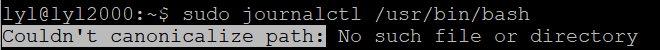
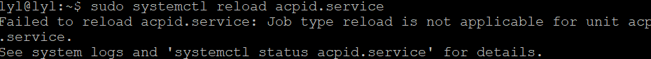

# 实验报告chap0x03
## 软件环境
Ubuntu 18.04 Server 64bit

putty
## 动手实战Systemd
* 命令篇
  
  [第3节(包含第2节内容)](https://asciinema.org/a/6uCGgml5Q5laQBJSqx3vIgu98)
  
  3.1 systemctl中重启，关机系统等命令asciinema不能录制，故没有在视频中出现

  [第4节](https://asciinema.org/a/ssMxSHHF5PXQBb4xzBzE10B6V)

  [第5,6,7节](https://asciinema.org/a/jHaH7XVa9kVqkwof7IrGoaNiR)
* 实战篇
  
  [所有章节](https://asciinema.org/a/9M4Ei1q5h2SkuS3vQXk7e5TvS)
## 自查清单
如何添加一个用户并使其具备sudo执行程序的权限？
* 添加用户
  
  + 1.adduser

    `sudo adduser username`
  
     然后填写,确认信息,添加成功
  + 2.useradd
    
    添加用户：`useradd username -m -s /bin/bash -d /home/username -g groupname`

    设置密码： `sudo passwd username`
* 使其具备sudo执行程序的权限
   + 切换到root下
   + 输入  `vi etc//etc/sudoers`,编辑该文件
   + 在`root ALL=(ALL:ALL) ALL`下添加`username ALL=(ALL:ALL) ALL`
   + 保存退出

如何将一个用户添加到一个用户组？

`usermod -a -G groupname username`

如何查看当前系统的分区表和文件系统详细信息？

root权限下： `fdisk -l` `df -lh`.

如何实现开机自动挂载Virtualbox的共享目录分区？
+ Virtualbox ubuntu设置-共享文件夹-添加共享目录
+ 虚拟机中输入`cd /mnt`
+ 创建挂载驱动器根目录的目录`sudo mkdir win10 share`
+ 进入挂载目录`cd win10/`
+ 新建挂载实际共享目录的目录`mkdir drv_d`
+ 修改/etc/fstab文件，添加`drv_d   /mnt/win10/drv_d    vboxsf  rw,auto 0   0`
  
基于LVM（逻辑分卷管理）的分区如何实现动态扩容和缩减容量？

 root权限下：
* 动态扩容：
  + 逻辑卷LV扩容:` lvextend -L +容量+磁盘`;
  + 文件系统扩容:ext4文件系统扩容使用`resize2fs [逻辑卷名称]`，xfs文件系统扩容使用`xfs_growfs 挂载点"`
* 缩减容量：`lvreduce -L -r +容量+磁盘`

如何通过systemd设置实现在网络连通时运行一个指定脚本，在网络断开时运行另一个脚本？

修改网络连接配置文件systemd-networkd的[Service]部分

`ExecStartPost=指定脚本 start`

`ExecStopPost=另一个脚本 start`

如何通过systemd设置实现一个脚本在任何情况下被杀死之后会立即重新启动？实现杀不死？

`sudo systemctl vi +脚本文件名`

修改配置文件，restart字段设为`always`，保存。
## 出现问题
+ 
  显示不能规范化路径，但是该路径通过查看是存在的，没有找到原因
+ 
  没有application这一个Unit
+ 
  reload不适用于这个配置文件
+ 
  这个target不能人为关闭，仅受依赖项请求。

## 参考文献
[Systemd 入门教程：命令篇 by 阮一峰的网络日志](http://www.ruanyifeng.com/blog/2016/03/systemd-tutorial-commands.html)

[Systemd 入门教程：实战篇 by 阮一峰的网络日志](http://www.ruanyifeng.com/blog/2016/03/systemd-tutorial-part-two.html)

[Linux下如何让普通用户具备sudo执行权限（普通用户提权）](https://blog.csdn.net/u012206617/article/details/100082021)

[Linux添加、创建新用户](https://www.cnblogs.com/zhyantao/p/10582839.html)

[在Virtualbox下为Ubuntu16.04开机自动挂载共享目录的最佳方法](https://www.jb51.net/article/170330.htm)

[LVM管理](https://www.cnblogs.com/diantong/p/10554831.html)