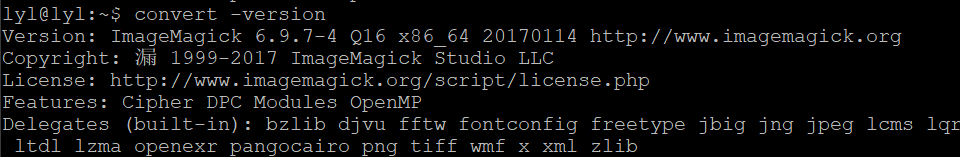
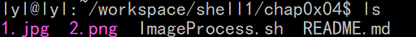
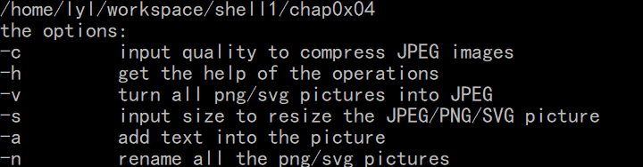
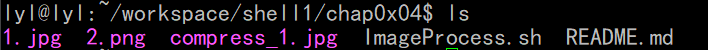
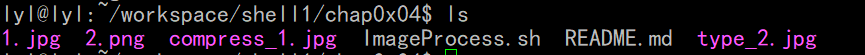
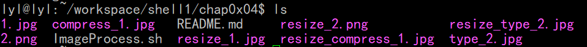
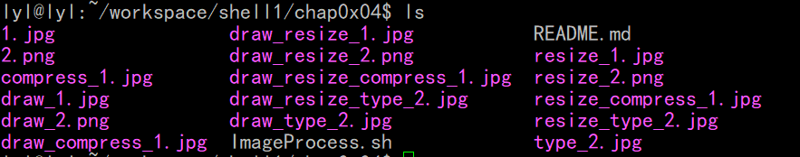
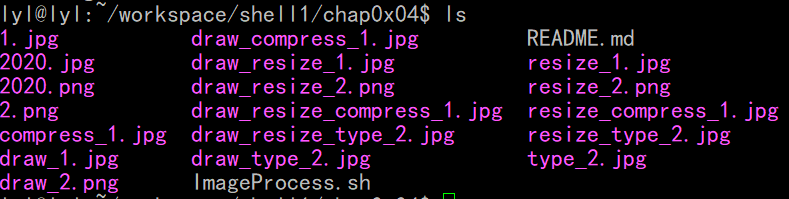

# chap0x04
# shell脚本编程基础
## 实验环境
ubuntu18.04.4

putty

imagemagick
## 安装imagemagick
``` 
sudo apt-get update 
sudo apt-get install imagemagick
```
检查是否安装成功
`convert -version`
如图：

## 任务一：用bash编写一个图片批处理脚本，实现以下功能： 
* 支持命令行参数方式使用不同功能
* 支持对指定目录下所有支持格式的图片文件进行批处理
* 支持以下常见图片批处理功能的单独使用或组合使用 
* 支持对jpeg格式图片进行图片质量压缩
  
`convert -quality num% &file &out #num表示压缩百分比数字`
* 支持对jpeg/png/svg格式图片在保持原始宽高比的前提下压缩分辨率
  
`convert -sample num%*num% xxx.jpg  xxx1.jpg #num表示压缩比例`
* 支持对图片批量添加自定义文本水印

```
convert -fill color -pointsize size -font char -draw 'text x,y "textwrite" ' xxx.jpg xxx1.jpg
 #color:文字颜色 size:文字大小 char:字体x,y:位置 textwrite:文本内容
 ```
* 支持批量重命名（统一添加文件名前缀或后缀，不影响原始文件扩展名）
创建新文件，新命名
* 支持将png/svg图片统一转换为jpg格式图片
  
`convert test.png test.jpg`
### 实验结果
原始情况

#### 运行脚本及其结果：

`bash ImageProcess.sh -h`



`bash ImageProcess.sh -c 80 #将所有JPEG文件质量压缩至80%`



`bash ImageProcess.sh -v`



`bash ImageProcess.sh -s 50 #压缩分辨率50%`



`bash ImageProcess.sh -a black 60 李奕霖cuc #批量在图片加上“李奕霖cuc”，字体为黑色，大小为60`



`bash ImageProcess.sh -n 2020 #批量重命名为2020`


***
## 任务二：用bash编写一个文本批处理脚本，对以下附件分别进行批量处理完成相应的数据统计任务： 
* 统计不同年龄区间范围（20岁以下、[20-30]、30岁以上）的球员数量、百分比
* 统计不同场上位置的球员数量、百分比
* 名字最长的球员是谁？名字最短的球员是谁？
* 年龄最大的球员是谁？年龄最小的球员是谁？
***
## 任务二：用bash编写一个文本批处理脚本，对以下附件分别进行批量处理完成相应的数据统计任务： 
* 统计访问来源主机TOP 100和分别对应出现的总次数
* 统计访问来源主机TOP 100 IP和分别对应出现的总次数
* 统计最频繁被访问的URL TOP 100
* 统计不同响应状态码的出现次数和对应百分比
* 分别统计不同4XX状态码对应的TOP 10 URL和对应出现的总次数
* 给定URL输出TOP 100访问来源主机  
***
## 参考文献
[linux-2019-Jasmine2020](https://github.com/CUCCS/linux-2019-Jasmine2020/blob/linux4/Lab4_Shell编程/lab4%20shell编程.md)
[Bash 中的特殊字符大全](https://linux.cn/article-5657-1.html)
[Shell表达式，如${file##*/}](https://www.cnblogs.com/-tbd-/p/12055351.html)
[ubuntu convert 命令](https://blog.csdn.net/HUXINY/article/details/87879249)
[玩转Bash脚本：选择结构之case](https://www.cnblogs.com/unclejelly/p/4082049.html)
[Linux shell脚本中shift的用法说明](https://blog.csdn.net/zhu_xun/article/details/24796235?utm_medium=distribute.pc_relevant.none-task-blog-BlogCommendFromBaidu-2&depth_1-utm_source=distribute.pc_relevant.none-task-blog-BlogCommendFromBaidu-2)