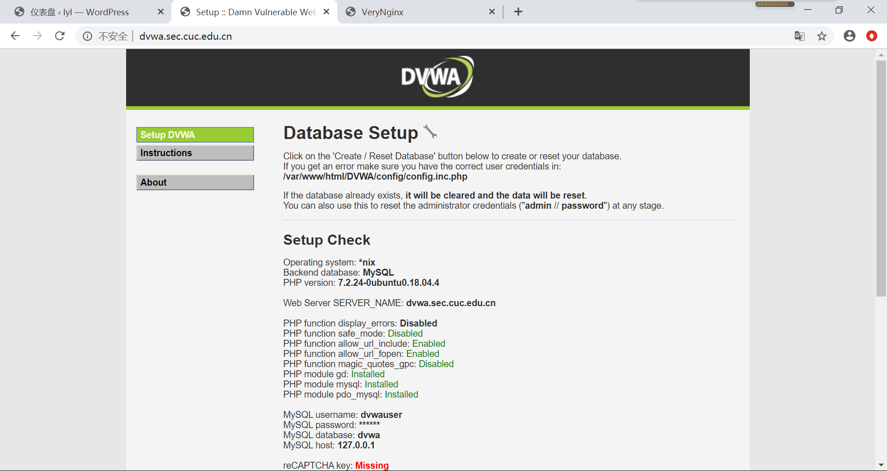
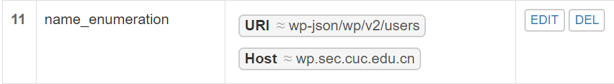
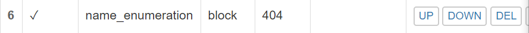

# chap0x05 web服务器
## 实验环境
ubuntu18.04.4

putty

VreyNginx

Wordpress

DVWA
## 在一台主机（虚拟机）上同时配置Nginx和VeryNginx
* 安装nginx
  ```
  sudo apt update
  sudo apt install nginx
  
  #创建nginx用户
  sudo adduser nginx

  ```
  
* 安装VeryNginx
  
  ```
  #克隆VeryNginx到本地
  git clone https://github.com/alexazhou/VeryNginx.git

  #安装相关依赖
  sudo apt install gcc
  sudo apt install make
  sudo apt install libssl1.0-dev libpcre3 libpcre3-dev
  sudo apt install zlib1g-dev

  #进入VeryNginx目录 
  cd VeryNginx

  #安装软件
  sudo python install.py install
  ```
  启动VeryNginx服务
  
  `sudo /opt/verynginx/openresty/nginx/sbin/nginx`

  无法启动,出现下面情况

  

  nginx和VeryNginx同时占用端口80

  为了能够同时开启Nginx和VeryNginx，可以将Nginx的端口改为8087
  ```
  # 修改配置文件，将端口号改为8087
  sudo vim /etc/nginx/sites-available/default
  ```
  重启nginx：`sudo service restart nginx`

  启动VeryNginx服务成功

  

  登陆verynginx的web界面
  网址：`http://{{your_machine_address}}/verynginx/index.html`

  用户名和密码:`verynginx/verynginx`

  

  * PHP-FPM进程的反向代理配置在nginx服务器上
  ```
  #安装mysql
  sudo apt install mysql-server

  #安装php-fpm模块以及一个附加的帮助程序包php-mysql
  sudo apt install php-fpm php-mysql

  #修改/etc/nginx/sites-enabled/default文件
  sudo nano /etc/nginx/sites-enabled/default
  ```
  添加如下内容：
  ```
  location ~ \.php$ {
      include snippets/fastcgi-php.conf;
       fastcgi_pass unix:/var/run/php/php7.2-fpm.sock;
  }

  ```
  重启nginx
* 基于LEMP安装WordPress
  + 安装步骤参考链接
  
    [How To Install WordPress with LEMP on Ubuntu 18.04](https://www.digitalocean.com/community/tutorials/how-to-install-wordpress-with-lemp-on-ubuntu-18-04)
    
  + 基本步骤如下：
     - 1.创建一个具有sudo权限的用户
       ```
       #以下均在root权限下

       #添加用户
       adduser sammy

       #使用户具有sudo权限
       usermod -aG sudo sammy
       ```   
        安装LEMP
     - 2. 安装mysql
       ```
       sudo apt install mysql-server
       sudo mysql_secure_installation

       #进入mysql
       sudo mysql

       #修改密码，变为mysql_native_password

       set global validate_password_policy=LOW; 

       ALTER USER 'root'@'localhost' IDENTIFIED WITH mysql_native_password BY 'password';
       
       #刷新
       FLUSH PRIVILEGES;
       ```   
     - 创建wordpress数据库
       ```
       CREATE DATABASE wordpress DEFAULT CHARACTER SET utf8 COLLATE utf8_unicode_ci;

       #授予所有权限给wordpressuser
       GRANT ALL ON wordpress.* TO 'wordpressuser'@'localhost' IDENTIFIED BY 'password';
       ```
     - 安装php扩展
       ```
       sudo apt update
       sudo apt install php-curl php-gd php-intl php-mbstring php-soap php-xml php-xmlrpc php-zip

       #使php处理器更新新的特征
       sudo systemctl restart php7.2-fpm
       ```
      - 下载wordpress
      ```
       cd /tmp
       curl -LO https://wordpress.org/latest.tar.gz
       # 解压文件
       tar xzvf latest.tar.gz
  
       #将示例配置文件复制到WordPress实际读取的文件中
       cp /tmp/wordpress/wp-config-sample.php /tmp/wordpress/wp-config.php

        # 将目录的全部内容复制到文档根目录中
        # -a标志用来维护权限
        sudo cp -a /tmp/wordpress/. /var/www/html/wq.sec.cuc.edu.cn
        #分配文件所有权至nginx运行的用户和组
        sudo chown -R www-data:www-data /var/www/html/wq.sec.cuc.edu.cn
        # 从WordPress密钥生成器中获取安全值
        curl -s https://api.wordpress.org/secret-key/1.1/salt/
      ```
      将安全值复制到`/var/www/html/wq.sec.cuc.edu.cn/wp-config.php`中，并修改数据库的设置
    - nginx配置
  
        改wp-config.php,更新数据库相关信息

        为wordpress创建配置文件/etc/nginx/sites-available/wp.sec.cuc.edu.cn

        创建软链接：`sudo ln -s /etc/nginx/sites-available/wp.sec.cuc.edu.cn /etc/nginx/sites-enabled/`
         ```
          # 在/etc/hosts中添加
         ip wp.sec.cuc.edu.cn
  
         # 在本机的/etc/hosts中添加同样的内容
         ip wp.sec.cuc.edu.cn

         ```
         重启nginx
        浏览器中访问可安装wordpress
         
         安装成功
         
      
* 安装DVWA
  使用DVWA搭建站点
  ```
  # 在/var/www/html目录下为DVWA创建目录
  sudo mkdir /var/www/html/DVWA
  # 将安装仓库克隆到临时目录下
  git clone https://github.com/ethicalhack3r/DVWA /tmp/DVWA
  # 将安装文件拷贝到/var/www/html/DVWA网站根目录下 
  sudo rsync -avP /tmp/DVWA/ /var/www/html/DVWA
  # 配置DVWA数据库连接详细信息，将此配置文件重命名
  cp /var/www/html/DVWA/config/config.inc.php.dist /var/www/html/DVWA/config/config.inc.php
  ```
  mysql中新建用户名DVWA
  修改DVWA文件配置：`sudo sudo vim /var/www/html/DVWA/config/config.inc.php`

  修改php配置：`vim /etc/php/7.2/fpm/php.ini`

  修改DVWA文件访问权限：`chown -R www-data.www-data /var/www/html/`

  为DVWA创建Nginx配置文件并添加服务模块:`sudo vim /etc/nginx/sites-avaliable/dvwa`

  创建软链接：`sudo ln -s /etc/nginx/sites-available/dvwa /etc/nginx/sites-enabled/`

  重启nginx
  
  在本机通过域名访问成功
  

## 基本要求实现
要修改设置，要执行`chmod -R 777 /opt/verynginx/verynginx/configs`
因为nginx 进程对 /opt/verynginx/verynginx/configs/ 无写权限
* VeryNginx作为本次实验的Web App的反向代理服务器和WAF
  + matcher
  
  + upstream proxy pass
  
* 安全加固要求
  + 使用IP地址方式均无法访问上述任意站点，并向访客展示自定义的友好错误提示信息页面-1
    - matcher 
    
    - response 
    
    - filter 
    
    - ip访问失败
     
  + Damn Vulnerable Web Application (DVWA)只允许白名单上的访客来源IP，其他来源的IP访问均向访客展示自定义的友好错误提示信息页面-2
   - matcher 
   
   - response 
   
   - filter 
   
   - dvwa白名单访问成功
   
   - dvwa不在白名单访问失败
   
  + 在不升级Wordpress版本的情况下，通过定制VeryNginx的访问控制策略规则，热修复WordPress < 4.7.1 - Username Enumeration
   - matcher
   
   - filter
   
   - 访问失败，返回404
  + 通过配置VeryNginx的Filter规则实现对Damn Vulnerable Web Application (DVWA)的SQL注入实验在低安全等级条件下进行防护
   - 思路:匹配请求参数中出现的union,select,order by等可能的sql注入语句字符串
     matcher
      
     response
      
     filter 
      
* VeryNginx配置要求
 + VeryNginx的Web管理页面仅允许白名单上的访客来源IP，其他来源的IP访问均向访客展示自定义的友好错误提示信息页面-3
    - matcher 
    
    - response 
    
    - filter 
    
  + 通过定制VeryNginx的访问控制策略规则实现： 
   - 限制DVWA站点的单IP访问速率为每秒请求数 < 50
   - 限制Wordpress站点的单IP访问速率为每秒请求数 < 20
   - 超过访问频率限制的请求直接返回自定义错误提示信息页面-4
     
     frequency limit 
     
     response 
     

   - 禁止curl访问
     
     matcher
     
     response
          
     filter
     

     实验结果
     
## 参考文献
[linux-2019-luyj](https://github.com/CUCCS/linux-2019-luyj/blob/Linux_exp0x05/Linux_exp0x05/Linux_exp0x05.md)

[How To Install WordPress with LEMP on Ubuntu 18.04](https://www.digitalocean.com/community/tutorials/how-to-install-wordpress-with-lemp-on-ubuntu-18-04)

[alexazhou/VeryNginx](https://github.com/alexazhou/VeryNginx)