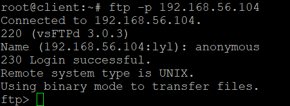

# Chap0x06 shell脚本编程练习进阶
## 实验环境
ubuntu18.04

putty

工作主机host-only:`192.168.56.103`

目标主机host-only:`192.168.56.104`
## shell文件build结果
[shells仓库sh文件build-passing](https://travis-ci.com/github/Beautifullyl/shells)

## 工作主机免密SSH登录目标主机
以下在工作主机：
```
# 在工作主机生成ssh-key
ssh-keygen -b 4096

#工作主机通过ssh-copy-id方式导入ssh-key 
ssh-copy-id -i ~/.ssh/id_rsa.pub root@192.168.56.104

#修改主机名，以分辨在哪台主机上，这里我将目标主机改名为client
sudo hostnamectl set-hostname newname
```
------

## FTP 
### 实验工具
vsftpd
#### 1.选择原因
+ 安全性高
+ 轻量级
+ 大型站点信任并使用vsftpd
+ CVE漏洞数量位于ProFTPd和PureFTPd之间
#### 2.参考资料
+ [proftpd vs pureftpd vs vsftpd](https://systembash.com/evaluating-ftp-servers-proftpd-vs-pureftpd-vs-vsftpd
)
### 实验过程
实验文件
[vsftp.sh](scripts/vsftpd.sh)

[vsftp.conf](configs/vsftpd.conf)
```
#将sh文件复制到目标主机
scp vsftpd.sh root@192.168.56.104:~/
#在远程目标主机bash文件
ssh root@192.168.56.104  bash vsftpd.sh
```
1.将vsftp.sh文件复制到目标主机


2.在远程目标主机bash文件


3.访问ftp服务器成功


### 实验任务
+ 配置一个提供匿名访问的FTP服务器，匿名访问者可以访问1个目录且仅拥有该目录及其所有子目录的只读访问权限；
  - 在vsftpd.userlist中添加anonymous，才可以实现匿名访问
  
  

+ 配置一个支持用户名和密码方式访问的账号，该账号继承匿名访问者所有权限，且拥有对另1个独立目录及其子目录完整读写（包括创建目录、修改文件、删除文件等）权限；
  - 用户访问ftp服务器成功
  
    
  - 在sammy用户的目录下出现了匿名用户目录下的文件，可证明继承匿名者访问权限
     匿名以及sammy用户都有test.txt文件
     
     
   

+ 该账号仅可用于FTP服务访问，不能用于系统shell登录；
  修改`/etc/shells`，在shell列表中添加一行`/usr/bin/nologin`

+ FTP用户不能越权访问指定目录之外的任意其他目录和文件；

+ 匿名访问权限仅限白名单IP来源用户访问，禁止白名单IP以外的访问；
  在`/etc/hosts.allow`中加入物理主机IP(192.168.56.103)
  ```
  vsftpd:192.168.56.103:allow
  ```
### 参考资料

[How To Set Up vsftpd for a User's Directory on Ubuntu 18.04](https://www.digitalocean.com/community/tutorials/how-to-set-up-vsftpd-for-a-user-s-directory-on-ubuntu-18-04)

[How To Set Up vsftpd for Anonymous Downloads on Ubuntu 16.04](https://www.digitalocean.com/community/tutorials/how-to-set-up-vsftpd-for-anonymous-downloads-on-ubuntu-16-04)

------
## NFS
### 实验文件
[nfs_s.sh](scripts/nfs_s.sh)

[nfs_c.sh](scripts/nfs_c.sh)

[exports](configs/exports)
### 实验过程
+ 将`nfs_s.sh`拷贝到目标主机，工作主机运行`nfs_s.sh`脚本 
+ 在工作主机运行`nfs_c.sh`脚本
+ 在/etc/exports文件中添加
   ```
   /var/nfs/gen_r 192.168.56.104(ro,sync,no_subtree_check)
   /var/nfs/gen_rw 192.168.56.104(rw,sync,no_subtree_check)
   /home/no_rsquash 192.168.56.104(rw,sync,no_subtree_check,no_root_squash)
   /home/rsquash 192.168.56.104(rw,sync,no_subtree_check)
   ```
### 实验任务
+ 在1台Linux上配置NFS服务，另1台电脑上配置NFS客户端挂载2个权限不同的共享目录，分别对应只读访问和读写访问权限；
  - 只读：`/var/nfs/gen_r`读写：`/var/nfs/gen_rw`
可以在客户端`gen_rw`目录中创建文件，不可以在客户端`gen_r`目录中创建文件

     

     
+ 实验报告中请记录你在NFS客户端上看到的：
  - 共享目录中文件、子目录的属主、权限信息

    + server
  
      
    + client 
      
      

  - 上述共享目录中文件、子目录的属主、权限信息和在NFS服务器端上查看到的信息一样吗？无论是否一致，请给出你查到的资料是如何讲解NFS目录中的属主和属主组信息应该如何正确解读
     + 客户端与服务器端一致的只是uid和gid,不同主机上的相同uid和gid 并不意味着映射到相同的用户名和组名
### 参考资料
[how to set up an nfs mount on ubuntu 18.04](https://www.digitalocean.com/community/tutorials/how-to-set-up-an-nfs-mount-on-ubuntu-18-04)

-------
### DHCP
### 实验文件
[dhcp.sh](scripts/dhcp.sh)

[dhcpd.conf](configs/dhcpd.conf)

[isc-dhcp-server](configs/isc-dhcp-server)
### 实验过程
编辑/etc/netplan/01-netcfg.yaml文件
+ client
  ```
  network:
  version: 2
  renderer: networkd
  ethernets:
  enp0s3:
        dhcp4: yes
        dhcp6: yes
    enp0s8:
        dhcp4: yes
        dhcp6: yes
        dhcp-identifier: mac
    enp0s9:
        dhcp4: yes
        dhcp6: yes
  ```
+ server
  ```
  network:
  version: 2
  renderer: networkd
  ethernets:
     enp0s3:
       dhcp4: yes
       dhcp6: yes
     enp0s8:
       dhcp4: yes
       dhcp6: yes
       dhcp-identifier: mac
     enp0s9:
        dhcp4: no
        dhcp6: no
        dhcp-identifier: mac
        addresses: [192.168.57.1/24]
  ```
  `sudo netplan apply`使配置生效
   + server

     运行脚本,修改`/etc/default/isc-dhcp-server`文件
     如下：
     ```
     INTERFACESv4="enp0s9"
     INTERFACESv6="enp0s9"
     ```
   + client

     修改/etc/netplan/01-netcfg.yaml,开启dhcp

  检查dhcp服务是否正确工作`sudo netstat -uap`
  
--------
## DNS[手动配置]
### 实验过程
+ server
  - 安装bind
     ```
     sudo apt-get install bind9
     ```
  - 修改配置文件/etc/bind/named.conf.options,添加以下： 
     ```
     listen-on { 192.168.57.1; };
     allow-transfer { none; };
     forwarders {
      8.8.8.8;
      8.8.4.4;
     };
     ```
  - 编辑配置文件/etc/bind/named.conf.local
     ```
     zone "cuc.edu.cn" {
     type master;
     file "/etc/bind/db.cuc.edu.cn";
     };
     ```
  - 生成配置文件`db.cuc.edu.cn` 
     ```
     sudo cp /etc/bind/db.local /etc/bind/db.cuc.edu.cn
     ```
  - 编辑配置文件`db.cuc.edu.cn`,添加以下：
     ```
     ;@      IN      NS      localhost.
             IN      NS      ns.cuc.edu.cn.
     ns      IN      A       192.168.57.1
      wp.sec.cuc.edu.cn.      IN      A       192.168.57.1
      dvwa.sec.cuc.edu.cn.    IN      CNAME   wp.sec.cuc.edu.cn.
     @       IN      AAAA    ::1
     ```
+ client
  - 安装resolvconf
     ```
     sudo apt-get update && sudo apt-get install resolvconf
     ``` 
  - 修改配置文件vim /etc/resolvconf/resolv.conf.d/head,添加以下：
     ```
     search cuc.edu.cn
     nameserver 192.168.57.1
     ```
### 实验结果

  
-------
## Samba
### 实验文件
[smbd.sh](scripts/smbd.sh)

[smb.conf](configs/smb.conf)
### 实验要求
+ 在windows 10客户端上连接Linux上的Samba服务器
win+R，输入：`\\192.168.56.103`,打开共享文件夹


+ Linux访问Windows的匿名共享目录guest
   
  
+ Linux访问Windows的用户名密码方式共享目录
  
  
+ 选中demo，点击右键，选择映射网络驱动器,将共享文件夹映射到此电脑目录中
   
    
### 参考资料
[linux-2019-luyj](https://github.com/CUCCS/linux-2019-luyj/blob/Linux_exp0x06/Linux_exp0x06/Linux_exp0x06.md)

[Ubuntu 18.04安装Samba服务器及配置](https://www.linuxidc.com/Linux/2018-11/155466.htm)